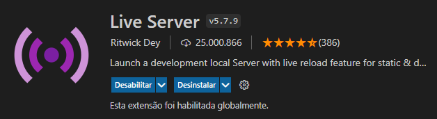
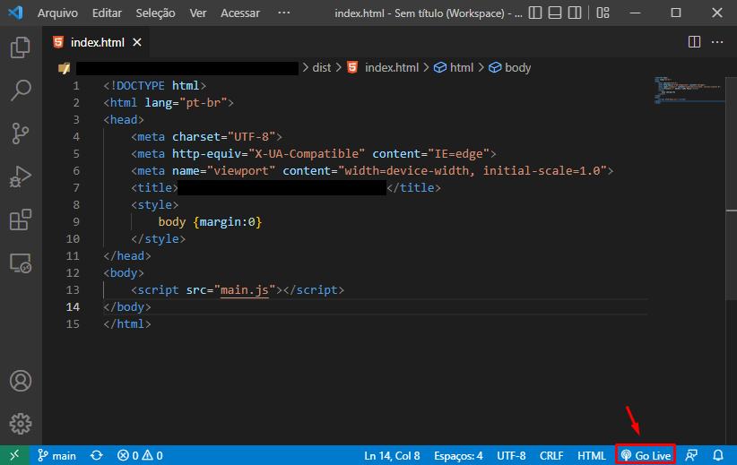
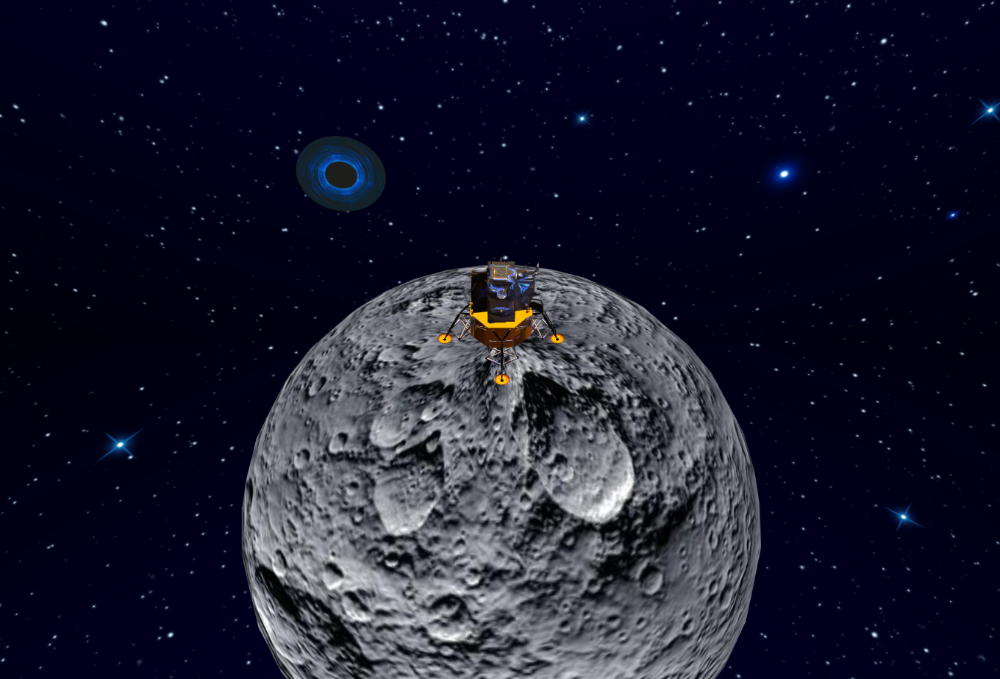

# Projeto 2 - Computação Gráfica
### Definição:
- Esse projeto foi desenvolvido como parte das exigências da disciplina Computação Gráfica, do curso de Engenharia de Computação da Universidade do Oeste de Santa Catarina.

### Objetivo:
Implementar uma aplicação em Three.js com uma cena 3D composta pelos seguintes itens:   
- Um objeto 3D sofrendo transformações geométricas de translação, escala e rotação no decorrer do tempo;
- Durante a animação o objeto precisa estar totalmente dentro da cena, ou seja, os limites da cena não devem ser ultrapassados pelo objeto.


### Desenvolvido por:
- João Paulo Caetano e Adinã Genaro.

### Pastas do projeto:
- **apollo_lunar_module =** pasta onde se encontra o arquivo .gltf e suas extensões, utilizado para inserir o apollo lunar no projeto;  
- **dist =** distribuition, arquivos que vão ser distribuidos no projeto;
- **images =** imagens que foram utilizadas no projeto, especificamente pra construção desse README e na construção da cena (background);
- **src =** pasta que armazena os códigos fonte;
- **textures** = texturas que foram utilizadas no projeto, especificamente na modelagem da lua, do buraco negro e do apollo lunar.

## Instruções para instalar e rodar a aplicação:
 - Primeiramente deve-se instalar o **Node.js**, caso você ainda não o tenha em sua máquina, segue o link abaixo para download e instalação:  

    [Página de Download do Node.js](https://nodejs.org/en/download/)  

 - Com o Node.js instalado, abra o projeto pelo **Visual Studio Code** e use o seguinte comando no seu terminal para verificar a instalação do mesmo e sua versão: 
 
```sh
 npm --v
```

 - Com a instalação verificada, use o seguinte comando para a instalação dos módulos do Node.js utilizados:

```sh
 npm install
```

- Após esse comando irá aparecer uma pasta chamada **_node_modules_** no seu projeto, onde são carregadas todas as dependências do Node.js que serão utilizadas no projeto. Com isso faça a build do projeto:

```sh
 npm run build
```

- Em seu Visual Studio Code, instale a extensão **Live Server**, que vai permitir que você visualize o projeto pelo seu navegador:



- Para finalizar, com a instalação do Live Server, abra o arquivo **_index.html_** localizado na pasta **_dist_** e clique no botão **Go Live**, localizado na parte inferior direita para fazer a visualização do projeto em seu navegador (importante que o navegador padrão seja o chrome, pois o edge tem problemas de incompatibilidade com algumas das funcionalidades do projeto):



- Com todos os passos acima realizados você poderá visualizar o projeto como na imagem de exemplo abaixo:



 **Obs.:** é possível controlar a câmera, alterando a posição da visão (clicando e arrastando o mouse) e alterar o zoom (rolando scroll do mouse).